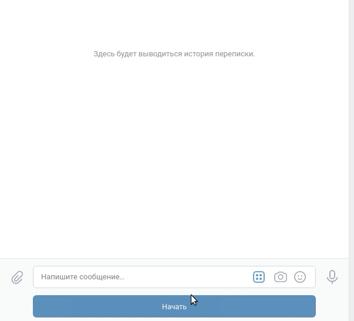

# Telegram and VK Quiz bots

Telegram and VK Quiz bots.

## How to install


1. First if all, generate some quiz data for the bots. You will need files with questions and answers and they should be formatted like this:
```
Вопрос: <YOUR_QUESTION_HERE>

Ответ: <YOUR_ANSWER_HERE>

```
To generate quiz data for current bots use:
```bash
$ python get_questions_list.py <path to directory with quiz files> <path to json file to save quiz data>
```
2. Register on [redislabs](https://redislabs.com/). Get your free server. Find your server's settings and get your redis connection url and password.
3. To use Telegram bot:
    1. You need to register two new bots on [Telegram](https://telegram.org/). Find `@BotFather` bot in your app, type `/newbot`, then follow the instructions of that bot. When you're finished, you'll get your bot api token, which looks like this - `95132391:wP3db3301vnrob33BZdb33KwP3db3F1I`. Create two bots, you'll use one as a quiz bot and other as a logging bot.
    2. Then you need to type `\start` in your bots chats.
    3. Go to `@myidbot` in Telegram app and type `\getid` to get your chat_id.
4. To use VK bot:
    1. Create VK Group - [here](https://vk.com/groups_create)
    2. Go to your group's Settings - API, create new API key and allow to send messages on behalf of the group. Save your API key somewhere safe.
6. Deploy.
    1. Locally
        - You need to create `.env` file in directory with this program and put there your dvmn api token, telegram bot tokens and your telegram chat_id. Your can also set long polling timeout and proxy for telegram bot, but its optional. `.env` file should look like this, but with your data instead:
            ```
             TELEGRAM_HELPER_BOT_TOKEN=<YOUR_TELEGRAM_HELPER_BOT_TOKEN>
             TELEGRAM_LOG_BOT_TOKEN=<YOUR_TELEGRAM_LOGGER_BOT_TOKEN>
             TELEGRAM_PROXY_URL=<PROXY_URL>
             TELEGRAM_CHAT_ID=<YOUR_TELEGRAM_CHAT_ID>
             VK_GROUP_TOKEN=<VK_GROUP_API_TOKEN>
             REDIS_CONN=<REDIS_HOST:REDIS_PORT>
             REDIS_PASSWORD=<YOUR_REDIS_PASSWORD>
             QUIZ_DATA_FILE=<PATH_TO_QUIZ_DATA_JSON_FILE>
            ```
        - Python3 should be already installed. The project was made using `Python 3.8.3`. This version or higher should be fine.
        - Then use `pip` (or `pip3`, if there is a conflict with Python2) to install dependencies:
            ```
            pip install -r requirements.txt
            ```
    2. Heroku
        - Register on [Heroku](https://www.heroku.com/). Connect your Heroku account to your GitHub account. Fork current repository to your account.
        - Create new app on [Heroku's Apps page](https://dashboard.heroku.com/apps).
        - Go to "Deploy" tab of your app and deploy `master` branch of the forked repository.
        - Go to "Settings" tab of your app and add your api keys and tokens into "Config Vars" section (for vars name reference, see 6.1).


## How to use

1. Locally
    
    To launch bots use following commands:
    ```
    $ python3 tg_bot.py
    $ python3 vk_bot.py 
    ```
2. Heroku

    Go to "Resources" tab of your app and turn on your bots.
    
Results:

Telegram bot example conversation:


VK bot example conversation:



## Project Goals

The code is written for educational purposes on online-course for web-developers [dvmn.org](https://dvmn.org/).
